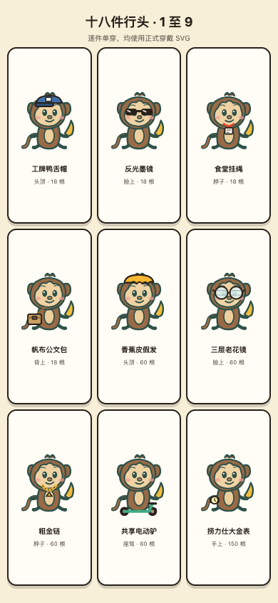
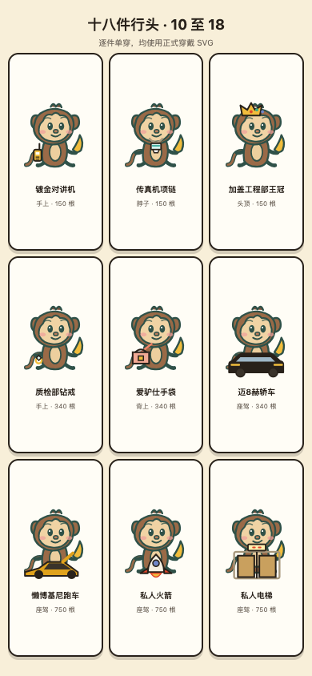
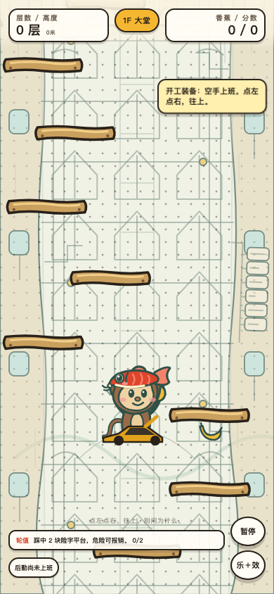
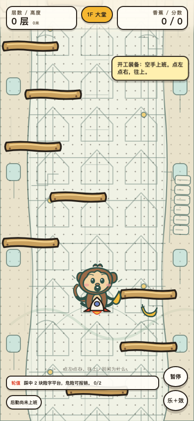
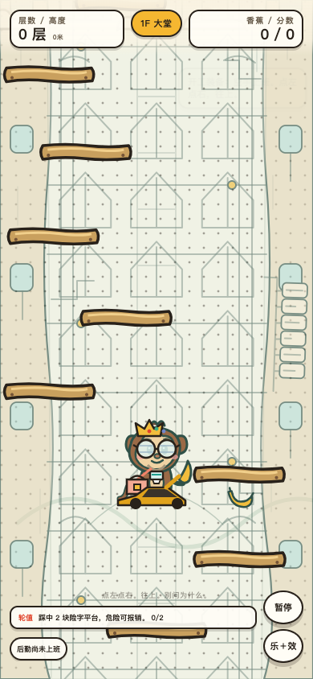
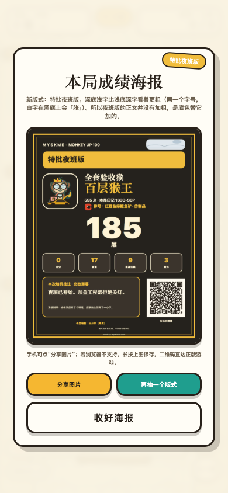

# 2026-08-14 · 《是猴就上100层》十八件行头视觉验收

## 结论

十八件行头逐件单穿、名称适配、红鲤鱼帽与座驾层级、火箭坠落姿势、六槽全套、全套夜班海报与二维码机器解码均通过。

发现一项不符合交接规格：私人电梯实际画在猴子前面，电梯门覆盖猴子的下半身；交接单要求它画在猴子身后。本项记录为 [败]，没有为了凑全绿写成通过，也没有在验收 PR 里擅自改生产层级。

真机边界：当前没有真手机接入，因此“用真手机相机扫描”没验到；本轮使用 Chrome 151 的二维码视觉解码器直接读取生成后的夜班版原图，成功解出正版游戏链接。这能证明二维码机器可读，但不能冒充真手机相机实扫。

## 环境

- 线上版本：`20260814.6-truegates`
- 线上正门：`https://monkey.myskme.com/`
- 视口：390 x 844，iPhone Safari UA，触控开启
- 浏览器：Google Chrome 151.0.7922.138
- 资源来源：正式 `SHOP_ITEMS`、`WEAR_ART`、`dressedMonkeySvg()` 与 `buildPoster()`

## 十八件逐件单穿

第一组：工牌鸭舌帽、反光墨镜、食堂挂绳、帆布公文包、香蕉皮假发、三层老花镜、粗金链、共享电动驴、捞力仕大金表。

第二组：镀金对讲机、传真机项链、加盖工程部王冠、质检部钻戒、爱驴仕手袋、迈8赫轿车、懒博基尼跑车、私人火箭、私人电梯。

[过] 两张九宫格都直接调用正式穿戴 SVG；18 件逐件单穿；商品名、槽位与价格未被裁；没有改行头名称或定价。





## 特殊组合

### 座驾 + 局内红鲤鱼帽

穿戴：买来的王冠 + 懒博基尼跑车，再触发局内红鲤鱼帽。

实际结果：

- `#gameShell`：`display: block`
- 主猴：`display: inline`
- 红鲤鱼帽：`display: inline`
- 买来的头饰 `.wear-head`：`display: none`
- 座驾层：存在

[过] 红帽压过买来的王冠，座驾仍在，整个游戏画面没有消失。帽子保持红色，没有改为鱼小姐的青绿色。



### 私人电梯

实际结果：猴子与 10 块平台都仍可见，游戏画面没有消失；但电梯门位于猴子图形前方，覆盖了身体下半部。

代码结构也与截图一致：`monkey/index.html` 的 `#playerGroup` 先放猴子 `<use>`，后放 `.wear-layer`；私人电梯属于 `.wear-ride`，因此实际叠在猴子上方，而不是交接单要求的“画在猴子身后”。

[败] 私人电梯层级与交接规格不一致。建议后续在生产修复分支中把座驾层拆到猴子前后两层，并为 `lift` 建立反向视觉门；本验收 PR 不改生产代码。


### 私人火箭坠落

实际结果：主猴姿势引用变为 `#art-monkey-fall`；火箭 `.wear-ride` 仍存在；角色保持可见。

[过] 坠落姿势没有穿帮，火箭尖端、舷窗和尾焰都完整。



### 六槽全套

全套：加盖工程部王冠、三层老花镜、传真机项链、质检部钻戒、爱驴仕手袋、懒博基尼跑车。

实际绘制层：`wear-head / wear-eye / wear-neck / wear-hand / wear-back / wear-ride`，共六层。

[过] 六个槽位同时画齐，猴子脸部仍可辨认，平台与 HUD 没被行头覆盖。



## 全套夜班海报与二维码

强制抽到：`特批夜班版`，组合 `night|nordic`。

实际结果：

- 全套猴子印入左上角名片照。
- 夜班版正文、统计、批注与二维码清楚可见。
- 二维码：41 模块。
- 浏览器二维码视觉解码成功：`https://monkey.myskme.com/?from=poster&mark=1S3O-S0P&s=night&m=1`
- 解出的域名、纸型 `night` 与海报印记一致。

[过] 夜班版二维码实际机器可读，不是只数模块。




## 实际输出

```text
[过] 十八件逐件单穿：两张九宫格均完整，名字未截断
[过] 红鲤鱼帽 + 座驾：红帽可见，买来的头饰隐藏，画面未消失
[过] 私人电梯：猴子与平台仍可见
[过] 私人火箭：坠落姿势使用 art-monkey-fall，火箭仍在
[过] 全套行头：六槽位同时画齐
[过] 海报：特批夜班版，二维码 41 模块，组合 night|nordic
[过] 浏览器二维码解码：https://monkey.myskme.com/?from=poster&mark=1S3O-S0P&s=night&m=1
```

说明：上面脚本级输出里的“私人电梯：猴子与平台仍可见”只回答可见性；人工看图后追加的层级结论是 [败]，两者不是互相覆盖。

详细字段见 `截图/2026-08-14-十八件行头/metrics.json`。

## 没验到

- 真 iPhone / Android 上逐件触摸换装的手感。
- 真手机相机扫码；当前只有浏览器二维码视觉解码通过。
