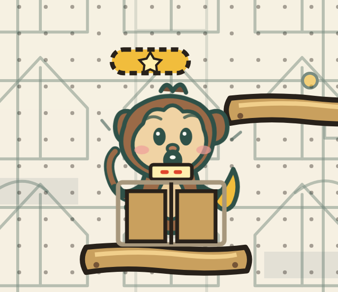
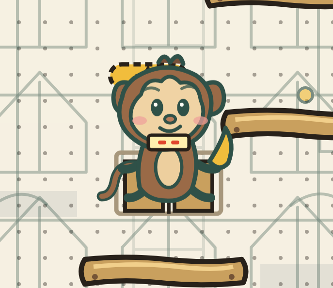
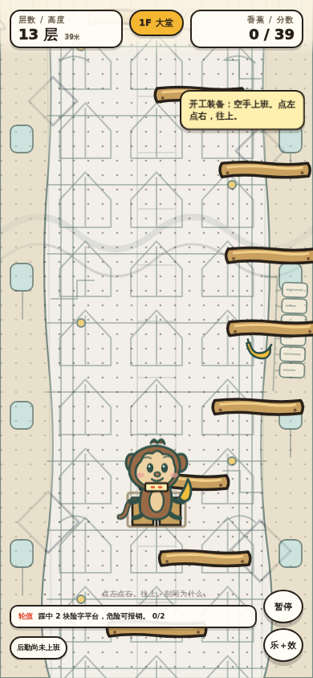
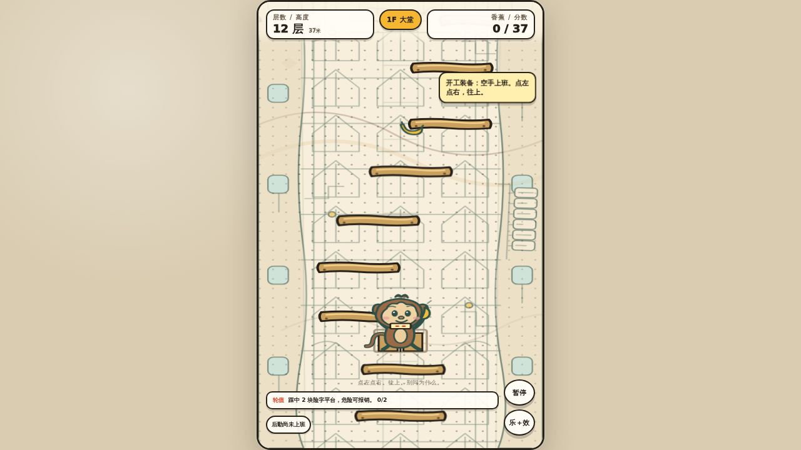
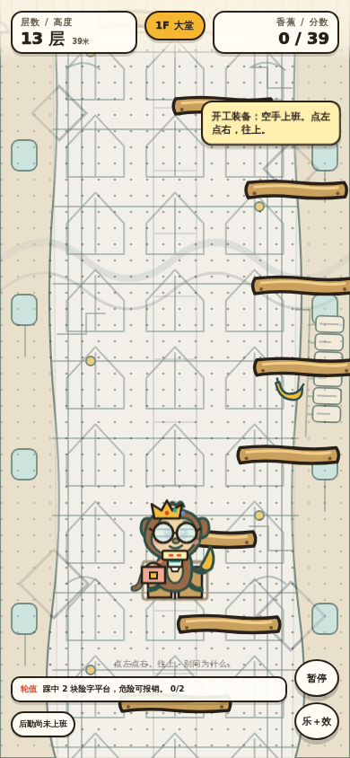
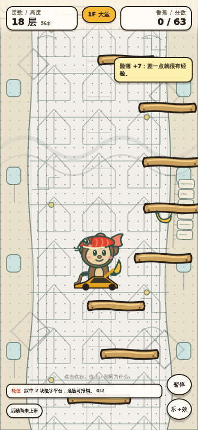
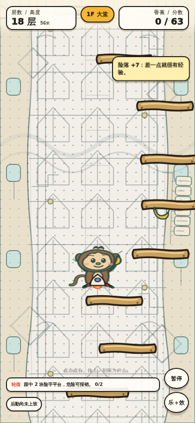
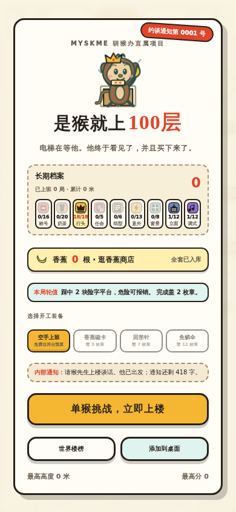
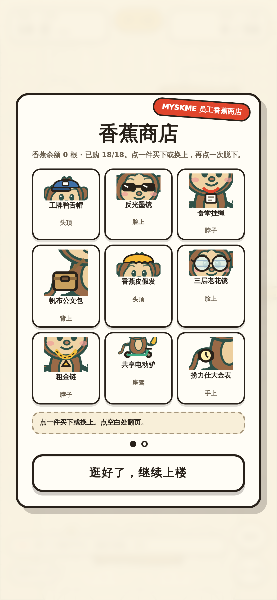

# 2026-08-14 · 私人电梯不再盖住猴子（附：自己写的两条假门）

## 结论

Codex 在 PR #50 的真机复核里报的那一条 [败]——私人电梯两扇门叠在猴子前方、
把下半身整个盖住——已修。修法是**给穿戴画两层**（猴子身后一层、身前一层），
哪一段画在身后由**画法字符串里的一个断点**决定。

版本 `20260814.6-truegates` -> `20260814.7-liftbehind`。**这一版没有合并、没有发布**，
等王老师点头。

---

## 一、为什么不是给电梯挪坐标

挪坐标只是把这一件改到「刚好不挡」。下一件体积大的行头（轿子、热气球、龙）
一进来又会重犯同一个毛病，而且到时候没人记得为什么电梯的 y 是那个数。

分层是把「谁该在身后」变成**画法里的一个断点**，以后加什么都不用再想这件事。

断点写在画法字符串里，而不是另开一张「哪几件在身后」的表——
**另开一张表就是又一份会漂的镜像**，美术改了那张表不会跟着改。
没有断点的行头整件画在前面，也就是原来的行为，十七件一个字没动。

## 二、踩的第一个坑：整件塞到身后，遮挡没了，东西也没了

第一版是「整件在前」或「整件在后」二选一，电梯选了「整件在后」。
遮挡确实消失了，所有断言全绿。**然后拍了张图**：





整件塞到身后那一版（中间那次，没留图）拍出来是个空框子，看着像纸箱——
**750 根香蕉买回来看不出那是电梯**。楼层显示牌和那两位红字才是「这是电梯」的记号，
它被猴子的胸口挡掉了。

所以电梯是**跨着两层**的那一件：实心的车厢与两扇门在身后，楼层显示牌在身前。
座驾里的车与滑板车仍然整件画在前面，那是「坐进车里」的视觉——一刀切按槽位会毁掉它。

**判据：正确性做满了不等于可用性做了。数值断言看不见「东西还在不在」。**

## 三、踩的第二个坑：图层名与槽位名撞车

图层第一版叫 `wear-back`。而「背上」这个槽位的类名也是 `wear-back`
（槽位类名是 `wear-<槽位id>`，背上的 id 就是 `back`）。
`querySelectorAll('.wear-back')` 把槽位那个 `<g>` 也当成图层刷，
电梯的图形被写进前面那层，**又画到猴子前面去了**。

和 `AGENTS.md` canon 锁里警告的 `carp-hat-on` 撞 `carp-hat` 是同一族错——
0813 那次整个游戏画面消失，三十条断言照样全过。改名 `wear-behind`，并加了断言。

## 四、这一轮抓到自己写的**两条假门**

反向验证时发现：撞名那条门和「身后层至少四处」那条门，**都写死了 `wear-behind` 这个名字**。

于是「把图层改名回 `wear-back`」——也就是当时真犯的那个错——
只会撞上写死名字的计数门，**撞名门永远走不到**。它看起来在岗，实际从来没被执行过。

两条都改成从源码现取：槽位名从 `SHOP_SLOTS` 取，图层名从 `querySelectorAll` 的调用现场取，
「身后是哪一层」认的不是名字、是**它收的是 `wornMarkup('back')` 的产物**。

**判据：门里抄的名字，和文档里抄的数字是同一类东西——会过期的镜像。**

## 五、新的验收工具：`monkey/tools/qa-wear-layers.mjs`

在真浏览器里对猴子身上打 5x6 网格做命中测试，问每个点「谁画在上面」。
两个视口（390x844 / 1280x720）各跑一遍、各拍一组图。

它自己带**控制组**：先把电梯搬回猴子前面（修之前的写法），确认这时真的报得出
「被盖住」。控制组红了，报的是**「量法本身失效了」**，而不是「电梯出了问题」——
两句话不一样，指向的排查方向完全不同。

写这个工具时又栽了两次，都是控制组照出来的：

1. 第一版用 `document.elementFromPoint`（单数）。局内左右两个**整屏触控按钮**盖在最上面，
   每一点都命中它们，三十个点全报「不是电梯」——**一条永远绿的量法**。改用复数版取整摞。
2. 第二版把「电梯在场、猴子不在场」也算成「盖住猴子」。那 2 个点上猴子本来就没画东西，
   **没有任何东西被盖住**。判据改成「两者同时在场且电梯在上」。
   *判据要跟着「玩家实际感知到的是什么」走，不是跟着数据结构走。*

门槛也没写死数字：控制组要求「盖住的点 >= 猴子实际画出来的点的五分之一」，
修好之后要求「掉到控制组的四分之一以下」。写死一个绝对数，美术改宽一点它就无故变红。

## 六、实际画面

| | |
|---|---|
| iPhone 390x844 · 电梯 |  |
| 桌面 1280x720 · 电梯 |  |
| 电梯 + 另外五槽 |  |
| 红鲤鱼帽 + 座驾 |  |
| 火箭 · 坠落姿势 |  |
| 首页那只猴子 |  |
| 货架试衣镜 |  |

红鲤鱼帽仍是 `#e0452c`，压过买来的王冠（`boughtHeadShown=false`），没有改成鱼小姐的青绿。

## 七、实际输出

```text
构建门禁          [过] 348393 B / ZIP 256177 B
反向验证 9 条     [过] 该绿的绿 1 条 + 该红的红 8 条
qa-viewports      [过] 7 个视口
qa-network        [过] 六种抖法
qa-wear-layers    [过] 390x844 与 1280x720；控制组命中 14 / 14，修好后 2 / 2
```

## 八、没验到

- **真手机**。这台机器没有可接的 iPhone / 安卓，也没有 `adb` / `devicectl`。
  刘海、底部横条、手指换装的手感、iOS Safari「加到主屏幕」后从图标二次启动，
  这四项和 Codex 在 PR #49 里的边界一样，仍然是**没验到**，不是通过。
- **线上**。容器到不了 `monkey.myskme.com`（走代理 403）。这一版没有发布。

## 九、留给王老师判断的

楼层显示牌现在贴在猴子胸口（见修之后那张图）。它读起来像「电梯的楼层显示」，
也像「猴子挂了个牌」——这是笑点尺度，**我判断不了，交给你看一眼**。
不喜欢的话有两条路：挪到头顶上方，或者干脆连它一起放到身后（那就退回纸箱那版）。
