# 2026-08-14 · 《是猴就上100层》竖屏与安装说明验收

## 结论

线上版本在 iPhone 390 x 844 与 Android 360 x 800 的浏览器设备模式下，没有横向溢出、页面滚动或卡片出界；iPhone 的 11 个目标页面均保持在同一屏内。首页卡片在 390 x 844 上从 y=30 延伸到 y=816，视觉上是完整占满，而不是浮在大块空白中的小卡片。

iOS 安装说明已经明确写出：先用 Safari、Chrome/微信等加到桌面的只是书签、仍会带地址栏、应在 Safari 里选择“添加到主屏幕”。本轮不需要改文案。

真机边界必须说清楚：当前 Mac 没有连接或可远程调试的 iPhone / Android，系统也没有 Xcode 的 `xctrace` / `devicectl` 与 Android `adb`。因此刘海、底部横条、手指操作手感、真实 Safari 添加到主屏幕后从图标二次启动，这四项本轮**没验到**；不能用设备模式截图冒充真机结论。

## 运行环境

- 线上正门：`https://monkey.myskme.com/`
- 版本：`20260814.6-truegates`
- iPhone 设备模式：390 x 844，iPhone Safari 18.6 UA，触控开启
- Android 设备模式：360 x 800，Pixel 8 / Chrome 151 UA，触控开启
- 浏览器：Google Chrome 151.0.7922.138
- 页面：线上现役文件，不是本地复制页

## iPhone 390 x 844 逐屏结果

### 首页

[过] 卡片 y=30 至 y=816，左右各 22px；九格收藏条、香蕉余额、轮值、四套装备、主按钮、世界榜与桌面安装入口全在首屏；没有地址栏空间造成的内部滚动。

手感描述：信息很多但层级仍清楚，卡片确实把屏幕用满，底部还留有 28px 呼吸空间。

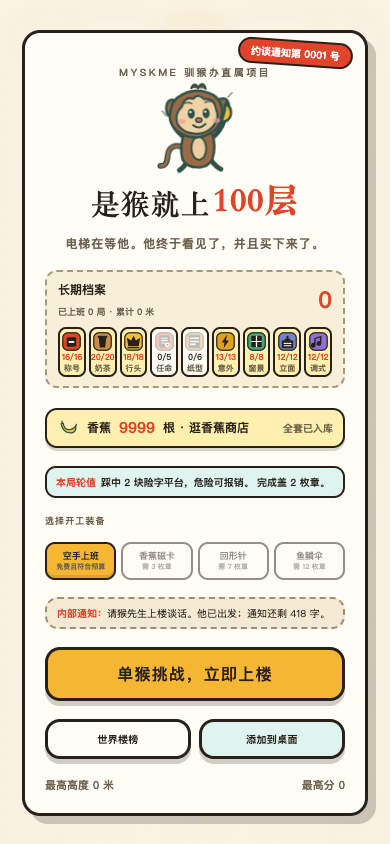

### 局内

[过] 猴先生、HUD、左右控制区、轮值提示、暂停与声音按钮都可见；猴子没有消失，底部操作提示没有盖住角色。

手感描述：主要操作区占满竖屏，角色、平台和任务条分区明确。

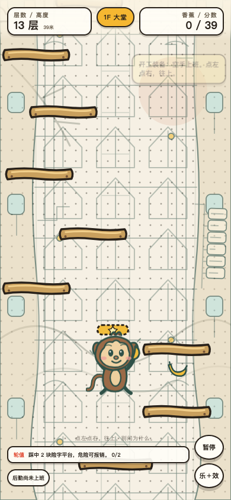

### 结算三页

[过] 成绩、本局档案、登记收藏三页都在单屏内；三个命名标签与常驻“再来一局 / 生成成绩海报”按钮始终可见。

手感描述：三页高度接近，切页不会让主要操作突然换位置。

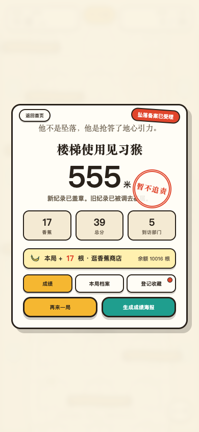

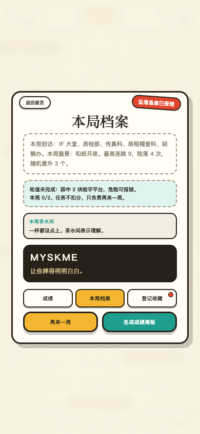

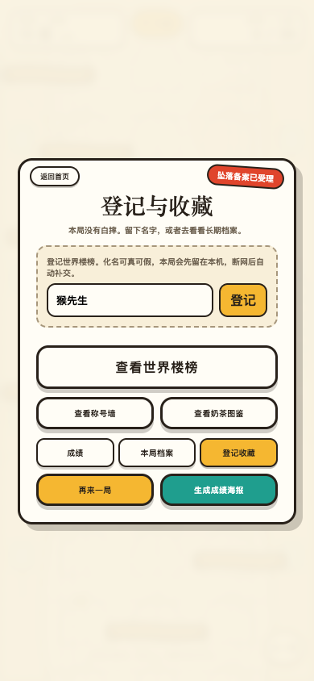

### 称号墙、奶茶图鉴、香蕉商店

[过] 三个收藏页面的条目、分页提示与退出按钮均完整。称号长名没有顶破卡片；奶茶 3 x 4；商店 3 x 3，商品名没有被裁。

手感描述：图鉴密度高但仍能一眼区分格子，分页点与返回按钮的位置统一。

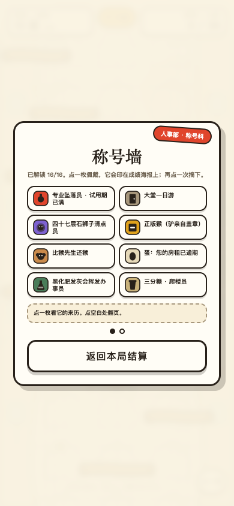


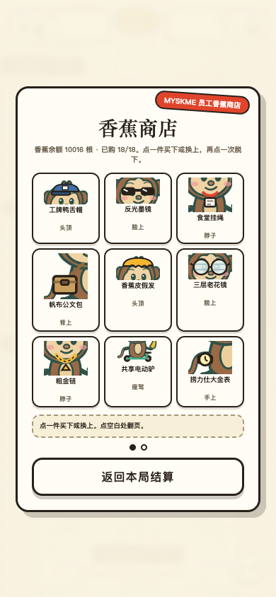

### 世界楼榜

[过] 三种口径、状态栏、五行排名、分页点与返回入口全部在同一屏内。

手感描述：榜单是高密度屏里最紧的一页，但当前 390 x 844 没有裁按钮，也没有让玩家困在页面里。

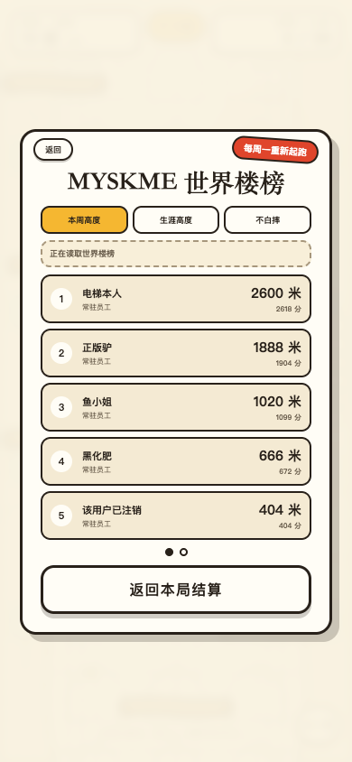

### 分享海报

[过] 海报预览、随机纸型说明、二维码、分享 / 重抽 / 关闭三类操作都完整出现；本次抽到“特批夜班版”。

手感描述：预览大小足以看出层级与二维码，操作区没有被海报挤出屏幕。

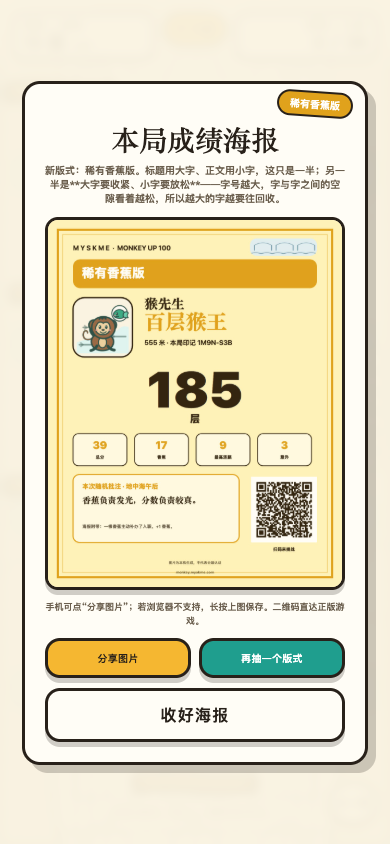

### iOS 安装说明

页面实际文字包含：

```text
先用 Safari 打开本页。用 Chrome、微信等加到桌面的只是书签，点开仍带地址栏，不会全屏。
点 Safari 底部的“分享”。
选择“添加到主屏幕”。
从桌面图标启动，应当没有地址栏、上下也没有留边。
```

[过] 误解风险已经被正面说明，不需要补文案。

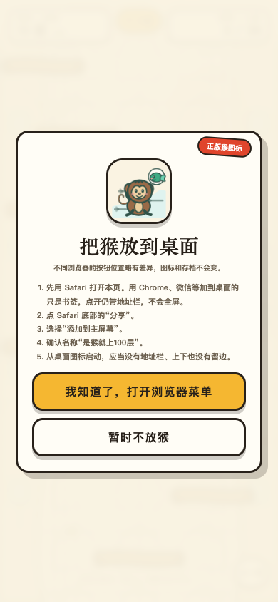

## Android 360 x 800 结果

[过] 首页、局内与安装说明没有横向溢出，卡片均在单屏内。首页比 iPhone 更紧，香蕉余额与轮值文字会自然换行，但没有被裁；主按钮和两个次入口仍完整可点。

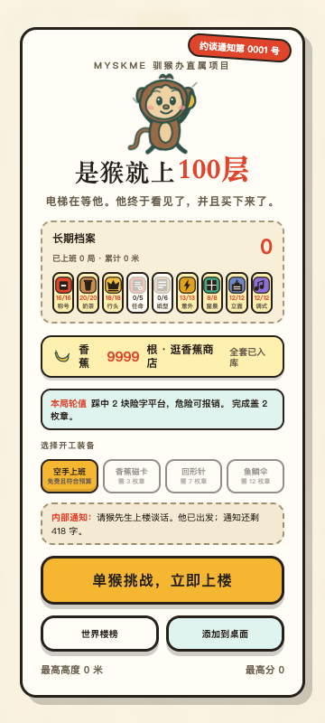

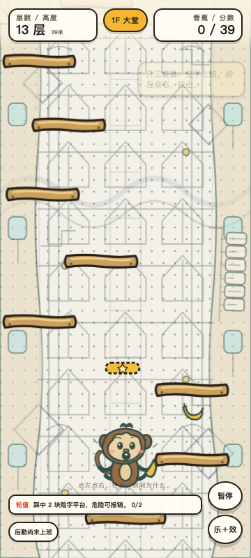

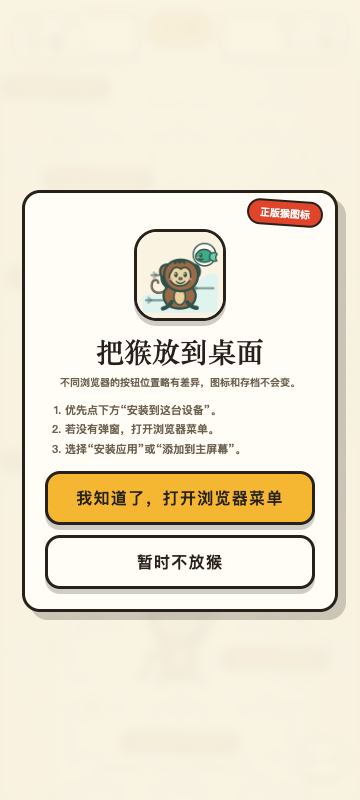

## 实际输出

```text
[过] iPhone 390x844：11 屏无横向溢出，卡片均在单屏内
[过] Android 360x800：首页、局内、安装说明无横向溢出，卡片均在单屏内
[过] iOS 安装说明明确写出 Safari / 书签 / 地址栏 / 添加到主屏幕
[过] Android 安装说明包含安装应用或添加到主屏幕
```

每屏的视口、文档尺寸、外壳尺寸、可见页面与卡片四边坐标，见 `截图/2026-08-14-竖屏与安装/metrics.json`。

## 没验到

- iPhone 真机刘海与底部横条是否影响内容。
- Android 真机厂商浏览器的实际可视高度。
- iOS Safari“添加到主屏幕”后，从桌面图标二次打开是否进入无地址栏独立窗口。
- 真机触摸、滑动与海报长按保存的手感。

需要真实手机接入这台 Mac，或由王老师在手机上逐屏拍照后，才能把这四项改成通过。
