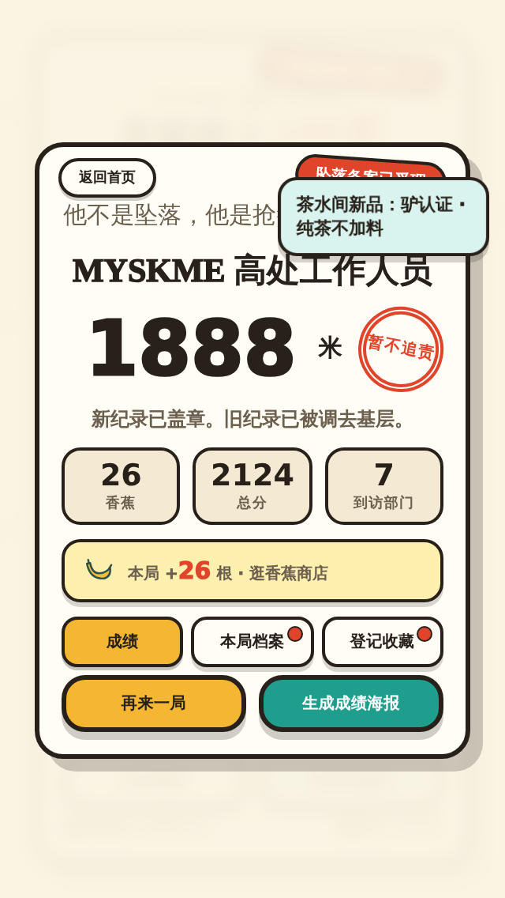
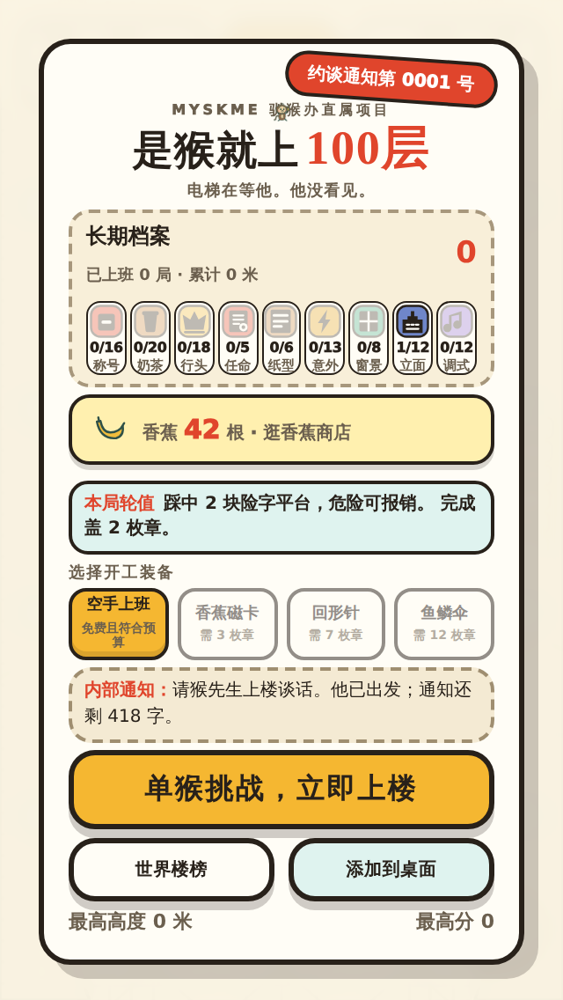

# 2026-08-14 · 第二轮：王老师的四句话，每句都量出来是真的

## 起因

王老师玩过之后留了四句话：香蕉吃了怎么还有；蛇和蛋基本没什么作用就是装饰；
三选一挺难触发碰到；香蕉的货币价值要有研究的最佳平衡性。

四句全部量证属实。**玩家的直觉是对的，只是他说不出根因**——根因得靠量。

## 每句话对应量出来的事实

| 他说的 | 量出来的 | 根因 |
|---|---|---|
| 香蕉吃了还有 | 已收集道具滞留中位 3916ms、最长 8333ms，同屏最多挂 7 个 | PR #46 加淡出时把 fade 写成 `declined?淡出:1`，收集这一支永远退不出绘制 |
| 蛇是装饰 | 8 局 603 次落脚，蛇台 **0 次** | 蛇排在第 8 个部门＝2100 米起，中位高度才 1768 |
| 三选一碰不到 | 一局只生成 1 排 | 第一排 1200 米、间隔 1500 米——不是难踩（命中 80%），是几乎不出现 |
| 香蕉价值要平衡 | 密度随高度从 18% 衰到 10% | **玩得越好每米赚得越少**；且定价按一个过期的测量值（14 根/局）定的，全套要 350 局 |

## 修法与结果

- fade 一行改对：`declined ? 淡出 : (collected ? 0 : 1)`。
- 部门出场顺序按「教什么」重排（教学词汇前置），带宽 300->240。蛇 0 -> 19 次。
- 任命 500 米开张、1100 米一排；收取半径**从排间距现算**。到手 0.4 -> 1.0 份/局。
- 密度恒定 .18 + 结算超线性高度奖金 6x千米^1.3 + 定价 25/70/170/360/780。
  收入 12 -> 25 根/局，全套 350 -> 180 局。

## 这一轮新学费（都已写进代码注释或门禁）

1. **加密度治不了「飞过去」。** 任命排从 1 排加到 1.8 排，到手份数一点没涨——
   一次弹跳 790，玩家从三块台子中间飞过去，34px 的框碰不到。
   要改的是收取语义：任命不是「捡到」，是「穿过那一层时选了哪边」。
2. **写死 70 差 1 像素照样漏。** span=142 时半格是 71。写死的数镜像的是
   「当时那一排有多宽」，而那是个会变的量（safeWidth 随高度变窄）。
3. **压低起点 ≠ 去掉斜率。** 密度 .18->.16 试了一轮，只惩罚了前期（实测那几局
   都在老曲线没怎么衰减的区段），撤回。要拿掉的是下降的斜率，不是整条线往下压。
4. **分母要写对。** 「生成了几排」里混着玩家根本没爬到的排（台子提前生成），
   拿它当分母，命中率被稀释成 44%，看起来像「碰不到」，其实是「还没走到」。
   换成「爬到了的排」做分母：100%。
5. **每局收入不能直接比，先除掉「跑多远」。** 部门顺序一改，高度分布就变；
   按每千米比才分得清「密度改了」和「跑得远近不同」。
6. **一条时红时绿的门，和一条永远绿的门一样害人。** qa-wear-layers 的控制组命中数
   随镜头位置在 10-14 之间飘，同一份源码时红时绿。钉住猴子再量，连跑三次逐字一致。
7. **测量脚本要钉住源码快照。** 「一边改 index.html 一边跑会读它的脚本」这个坑
   这几天撞了第四次，这次直接把快照读进内存，中途怎么改文件都不影响。
8. **判据先在已知坏版本上验证会红，再拿去量修好的。** qa-layout 三次判据写错
   （数基线当断行、比 top 当排数、只量矩形看不见字形溢出），全靠这一步照出来。

## 实际画面

| | |
|---|---|
| 320x568 结算：印章进了 flex 流，不再压 1888 |  |
| 320x568 首页：钱包一行，提示语窄屏自动让位 |  |

## 留给王老师亲自判断的

- 楼层显示牌贴在猴子胸口，读起来像「猴子挂了个牌」——笑点尺度。
- 传真科/房租稽查科的段子挪到 1440 米之后才出现，先教机关后讲段子的取舍。
- 新定价的手感。锚点是自动驾驶的中位（写明的假设），你真机玩几局再校准，
  校准时**整条阶梯按同样的方法重推**，别单独挪某一档。

## 没验到

真手机、线上、真人的局长与收入——同 PR #52 正文。
