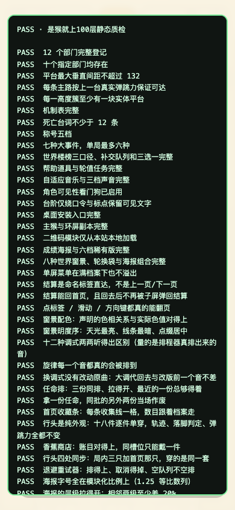
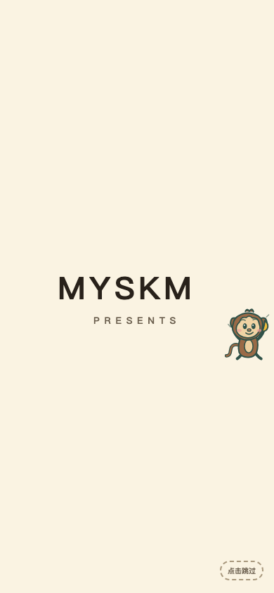
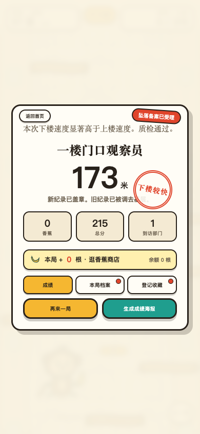
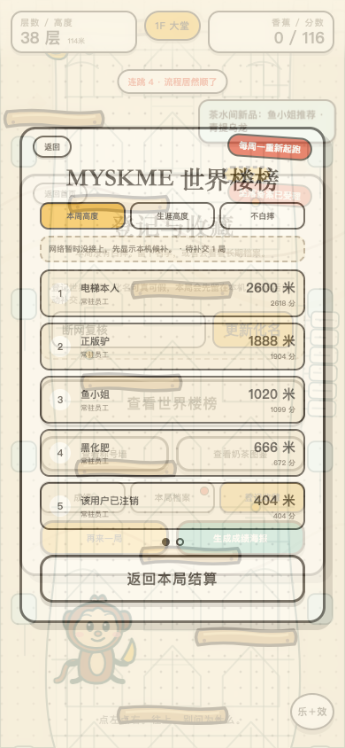
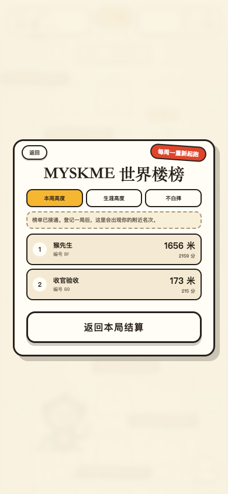

# 2026-08-14 · 《是猴就上100层》线上巡检与真实补交

## 结论

关键发布链路全绿：线上版本正确、61 条绿色结果无失败、在线正式局成功登记、真实关闭 Wi-Fi 后可由 PWA 离线冷启动并打一局、恢复 Wi-Fi 后待补交队列自动从 1 变为 0。

唯一没有在本项单独验到的是“把 PWA 安装壳写入真实手机主屏幕后，从图标二次打开”。本项已验到服务工作线程、真实断网冷启动和缓存换代；真机主屏安装归任务 2 继续验收，不把它写成已通过。

## 环境

- 时间：2026-08-14 13:00 CST
- 线上正门：`https://monkey.myskme.com/`
- macOS：15.7.7（24G720）
- 浏览器：Google Chrome 151.0.7922.138
- 手机视口：390 x 844，触控模式
- 真实网络接口：Wi-Fi `en0`
- 基线：`origin/main`，提交 `de6ceb7e57355b45a18ecc546940474beb421e8f`

## 逐项结果

### 1. 线上版本

- HTTP：200
- `<meta name="myskme-release">`：`20260814.6-truegates`
- `__MONKEY_UPSTAIRS_REPORT.release`：`20260814.6-truegates`
- 线上 HTML 与仓库 `monkey/index.html` 的 SHA-256 相同：`82842976e49ca7fc572089c0091365d793ec59c542cc3cc60f9f516d07845015`

结果：[过] 两处版本号一致，线上文件与当前发布源逐字节一致。

### 2. `?qa=1`

页面实际输出为：总结果 1 条 `PASS` + 逐项检查 60 条 `PASS` = 61 条绿色结果；`FAIL` 为 0。

结果：[过] 61 条绿色结果，控制台无脚本错误。



### 3. PWA 换代与真实离线启动

- 服务工作线程 scope：`https://monkey.myskme.com/`
- 首次登记后物理关闭 Wi-Fi，浏览器重新载入线上正门。
- 无网络时仍出现完整 MYSKME 启动画面和“点左点右”的游戏入口。
- 离线冷启动后可进入正式局，不依赖开发者工具的“模拟离线”。

结果：[过] 服务工作线程生效，真实断网冷启动成功，拿到的版本为 `20260814.6-truegates`。



### 4. 在线正式局与世界楼榜

- 正式局：173 米 / 215 分。
- 化名：`收官验收`。
- 登记后：待补交队列 0；世界楼榜启用标记为 1；服务器返回 64 位玩家令牌。

结果：[过] 在线正式成绩已经由服务器接收。



### 5. 真实断网正式局与自动补交

执行顺序与实际观测：

1. `/usr/sbin/networksetup -setairportpower en0 off`，回读 `Wi-Fi Power (en0): Off`。
2. 无网络重新打开游戏，打一局正式局：93 米 / 97 分。
3. 结算后本机队列变成“待补交 1 局”。
4. `/usr/sbin/networksetup -setairportpower en0 on` 恢复网络，没有点击登记或重试按钮。
5. 页面收到联网事件后自动发起补交；待补交从 1 变为 0；本机队列清空；服务器令牌仍有效。
6. 为复核可视状态，第二次真实断网跑了 114 米正式局；榜单明确显示“网络暂时没接上，先显示本机候补 · 待补交 1 局”。恢复网络后世界榜重新接通，游戏画面、榜单卡片与舞台均保持可见。

结果：[过] 本版主要修复点已在真实网络上跑通，不是浏览器模拟断网。





## 实际输出摘录

```text
[过] 线上版本一致：20260814.6-truegates
[过] 线上 61 条绿色结果：总结果 1 条 + 逐项检查 60 条，0 败
[过] 线上 QA 控制台无错误
[过] PWA 服务工作线程就绪：scope=https://monkey.myskme.com/
[过] 在线正式局完成：173 米 / 215 分
[过] 在线成绩登记：173 米，队列清零，服务器令牌已返回
[过] 真实关闭 Wi-Fi：Wi-Fi Power (en0): Off
[过] 真实断网后 PWA 仍可冷启动
[过] 离线正式局完成：93 米 / 97 分
[过] 离线成绩先写入本机：待补交 1 局
[过] 恢复网络后自动补交：93 米，待补交从 1 变为 0
[过] 正式局控制台无错误
```

补充说明：真实断网期间，Chrome 控制台会留下浏览器自身的 `net::ERR_INTERNET_DISCONNECTED` 资源错误；恢复网络后没有页面脚本异常。线上 `?qa=1` 与在线正式局控制台均为 0 错误。
