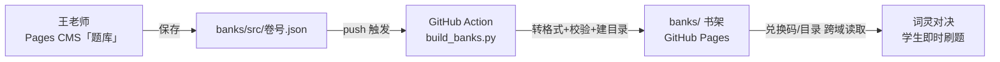

# MYSKME · 成果总览

> 狼先生与他的学生们 · *Make Yourself Special & Kind*
> 总入口：**https://myskme.github.io/myskme-hub/**

把"课上做卷 → 回家刷题 → 家长看见"这条留存闭环，连同作品门面与展示墙，整体打通并上线。三大块：**作品总目**、**优秀作文墙**、**题库训练系统（网页发题即时进游戏）**。

---

## 一、作品总目（Hub）

| | |
|---|---|
| GitHub Pages | https://myskme.github.io/myskme-hub/ |
| Netlify 副本 | https://myskme-hub.netlify.app |

六大作品的聚合门面：真实截图预览、明暗主题（默认跟随系统、可手动切）、**一页打印**、**竖版海报导出**（1080×1920，含全部二维码，发朋友圈/家长群）、**复制全部链接**、**课堂专用区可折叠**（家长视角默认收起）、页脚**分享二维码**、密码**管理员模式**可视化改内容并导出。

收录：MYSKME 积分板 · 三国军师争霸 · MYSKME 大乱斗 · 远征录·笼中剑 · 世界编年史 II · MYSKME 题库训练场。

**分享即带图**：发 hub / 书架 / 作文墙 链接到微信·家长群，会显示黑金封面预览卡（Open Graph）。页脚直达**题库书架 · 优秀作文墙**。**生态互链**：积分板 / 三国争霸 / 大乱斗 三个作品已加「← 作品总目」回链（远征录 / 世界编年史在 Netlify，待补）。

## 二、荣誉殿堂 · 优秀作文展示墙

| | |
|---|---|
| 线上 | https://myskme.github.io/myskme-hub/wall/ （班级口令 `myskme2026`） |

5 篇优秀手写作文真迹上墙：年级筛选、点击放大、金奖角标、王老师点评与亮点。
**自助上传**：Pages CMS「作文墙」集合——网页传扫描件 + 写点评 + 发布，自动上线，无需碰代码。

## 三、题库训练系统 —— 网页发题 → 自动构建 → 游戏即时生效

- **出题**：Pages CMS「题库」集合 → 写 `banks/src/<卷号>.json`（网页表单：配对题 / 选择题）。
- **构建**：`banks/src` 一变，GitHub Action 跑 `build_banks.py` → 转成游戏格式 + **校验**（答案越界、选项不足、空答案直接拦下不发布）+ 重建书架目录 → 自动提交。
- **上线**：`banks/` 经 GitHub Pages 发布为**枢纽书架**。
- **进游戏**：《词灵对决》兑换码/题库目录直接读枢纽书架（跨域已验证），**发布即生效，无需重部署**。

已上线题库（书架按系列分组，**6 辑 / 166 题**）：

| 兑换码 | 题库 | 题量 | 门槛 |
|---|---|---|---|
| `MIX1` / `MIX2` | 易混词训练营 · 一、二辑 | 30 + 30 | free |
| `TRAP1` | 语法陷阱 · 八类陷阱 | 32 | free |
| `TRAP2` | 假被动炼狱 · 亦真亦假 | 26 | svip |
| `TRAP3` | 时态错配炼狱 · 亦真亦假 | 24 | svip |
| `TRAP4` | 主谓一致炼狱 · 就近与整体 | 24 | svip |

每辑都过 **3 评审对抗审计**（答案唯一性 / 干扰项质量 / 释义准确）。免费 92 题 · 尊享 74 题。

数据契约：`schema/tiku.schema.json` + `schema/validate_tiku.py`；三层书架 `free / code / svip`。

**公开题库书架页**：https://myskme.github.io/myskme-hub/banks/ —— 读 `index.json` 自动展示全部已发布题库（兑换码 · 题量 · 难度 · 门槛 + 「去刷题」直达 `word-duel.html?code=`）。CMS 一发布即自动上架，零维护。可印在卷子上或发家长群当总目录。

## 四、词灵对决增强

- **主屏连胜火苗**：🔥 连续 N 天 · 最佳 M 天 + 近 7 日打卡点 + 今日任务（"明天再来"的钩子）。
- **卷尾二维码** `?code=卷号`：一扫即装当期题库（课上做卷 → 回家直接刷同款）。2026-07-12 网址搬 GitHub Pages（`myskme.github.io/myskme-quiz/word-duel.html?code=卷号`），参考模板已落地 `render_s2e5.py`；出卷 skill（插件）默认值待在其维护处更新（不在本地可编辑路径）。
- **题库书架改取枢纽**：网页发布的题库即时进游戏。
- **家长周报卡**（做好待上线）：战绩页一键生成可分享周报图（本周练习 + 连续打卡 + 累计成果 + 王老师寄语），发家长群——补上闭环最后一环"家长看见"。

## 五、仓库

- **myskme/myskme-hub**（公开）：作品总目 + 作文墙 + 题库书架 + 构建管线（`build_banks.py` / `.github/workflows/build-banks.yml`）+ CMS 配置（`.pages.yml`）+ 数据契约（`schema/`）。
- **myskme/myskme-games**（私有）：词灵对决 + 无名之原 + 题库训练场（部署到 Netlify `myskme-games`）。

## 六、自助后台（一次登录，长期自助）

**app.pagescms.org** → GitHub 登录 → 选 `myskme/myskme-hub` → 两个集合：
- 「作文墙」：传图 + 写点评 + 发布。
- 「题库」：填卷号/名称/难度/门槛 + 配对题 + 选择题 + 发布（自动构建进游戏）。
